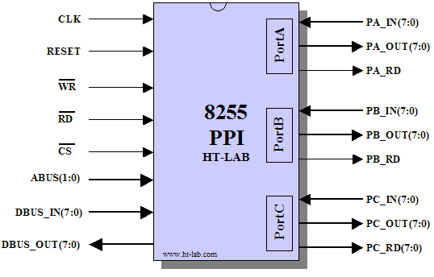

# HTL8255 8255 Compatible PPI IP core in VHDL

<p align="center">

</p>

## 1. Introduction


The HTL8255 is a synchronous implementation of the industry standard 8255/82C55 Programmable Parallel Interface (PPI) adaptor. The PPI can be used for a wide range of parallel I/O interface tasks. The HTL8255 is written in vendor neutral VHDL and can be synthesized for either ASIC or FPGA implementation.


## 2. Directory Structure

The directory structure is as follows:


|                   |                                        |
| ----------------- | -------------------------------------- |
| **Directory**     | **Contents**                           |
| HTL8255\bin       | Any executable files such as utilities |
| HTL8255\doc       | Documentation and Datasheets           |
| HTL8255\rtl       | Synthesizable IP Core                  |
| HTL8255\testbench | Testbench files                        |
| HTL8255\Modelsim  | Example script for Modelsim Simulator  |
| HTL8255\synthesis | Synthesis script and filelist          |


## 3. Filelist

The HTL8255 design is contained in three VHDL files and a separate top level wrapper that includes the tri-state drivers as shown in the diagram below.

|                  |                                                                                           |
| ---------------- | ----------------------------------------------------------------------------------------- |
| **Filename**     | **Contains**                                                                              |
| intra\_fsm.vhd   | PortA INTRA Finite State Machine logic                                                    |
| intrb\_fsm.vhd   | PortB INTRB Finite State Machine logic                                                    |
| htl8255.vhd      | Top level HTL8255 for instantiation                                                       |
| htl8255\_tri.vhd | Top level HTL8255 + Tri-State drivers for single chip implementation **<sup>note1</sup>** |

**Note1** : The original 82C55A device does not have a clock input and as such the HTL8255 cannot be used as a replacement without additional modifications.

## 4. Simulation


The HTL8255 is written in vendor neutral VHDL and as such can be simulated by any modern simulation tool.

An example simulation script is provided for Mentor Graphics’ Modelsim. To run the simulation execute the **simulation\run.do** file from within Modelsim. To run the simulation in command line mode execute the **simulation\run.bat** file in a Command (CMD) prompt, Cygwin shell or equivalent.

The output in both cases should be similar to the text shown below.

```
# vsim -c HTL8255_TriState_tb -do "set StdArithNoWarnings 1; run 100 us; quit"
#  run 100 us
# ------- Test Mode 0 PortA/B/C Output --------
# GroupA: Mode0  PortA=Output PortC(7:4)=Output  GroupB: Mode0 PortB=Output PortC(3:0)=Output
# ------- Test Mode 0 PortA/B/C Input --------
# GroupA: Mode0  PortA=Input  PortC(7:4)=Input   GroupB: Mode0 PortB=Input  PortC(3:0)=Input
# ------- Test Mode0 toggle portC bit --------
# GroupA: Mode0  PortA=Output PortC(7:4)=Output  GroupB: Mode0 PortB=Output PortC(3:0)=Output
# ------- Test Mode0 split PortC I/O  --------
# GroupA: Mode0  PortA=Output PortC(7:4)=Output  GroupB: Mode0 PortB=Output PortC(3:0)=Input
# ------- Test Mode1 Port A/B Input, PCH in, PCL out --------
# GroupA: Mode0  PortA=Output PortC(7:4)=Input   GroupB: Mode0 PortB=Input  PortC(3:0)=Output
# ------- Test Mode1 Port A/B Strobed Output --------
# GroupA: Mode1  PortA=Output PortC(7:4)=Output  GroupB: Mode1 PortB=Output PortC(3:0)=Output
# ------- Test Mode1 PortA Strobed Output + Interrupts --------
# GroupA: Mode1  PortA=Output PortC(7:4)=Output  GroupB: Mode0 PortB=Output PortC(3:0)=Output
# ------- Test Mode1 PortB Strobed Output + Interrupts --------
# GroupA: Mode0  PortA=Input  PortC(7:4)=Input   GroupB: Mode1 PortB=Output PortC(3:0)=Output
# ------- Test Mode1 PortA Strobed Input --------
# GroupA: Mode1  PortA=Input  PortC(7:4)=Output  GroupB: Mode0 PortB=Input  PortC(3:0)=Output
# ------- Test Mode1 PortB Strobed Input --------
# GroupA: Mode0  PortA=Input  PortC(7:4)=Output  GroupB: Mode1 PortB=Input  PortC(3:0)=Output
# ------- Test Mode1 PortA Strobed Input + Interrupts --------
# GroupA: Mode1  PortA=Input  PortC(7:4)=Output  GroupB: Mode0 PortB=Input  PortC(3:0)=Output
# ------- Test Mode1 PortB Strobed Input --------
# GroupA: Mode0  PortA=Input  PortC(7:4)=Output  GroupB: Mode1 PortB=Input  PortC(3:0)=Output
# ------- Test PortA Mode1, PortB Mode0 PortC Output  --------
# GroupA: Mode1  PortA=Output PortC(7:4)=Output  GroupB: Mode0 PortB=Output PortC(3:0)=Output
# ------- Test PortA/B Mode1, PortC Output  --------
# GroupA: Mode1  PortA=Output PortC(7:4)=Output  GroupB: Mode1 PortB=Output PortC(3:0)=Output
# ------- Test PortA/B Mode1 Input, PortC Output  --------
# GroupA: Mode1  PortA=Input  PortC(7:4)=Output  GroupB: Mode1 PortB=Input  PortC(3:0)=Output
# ------- Test Mode2 PortA Bidirectional I/O --------
# GroupA: Mode2  PortA=Output PortC(7:4)=Output  GroupB: Mode0 PortB=Input  PortC(3:0)=Output
# ------- Test PortA Mode2, PortB Mode0 Input, PortC Output --------
# GroupA: Mode2  PortA=Output PortC(7:4)=Output  GroupB: Mode0 PortB=Input  PortC(3:0)=Output
# ------- Test PortA Mode2, PortB Mode1 Output, PortC Output --------
# GroupA: Mode2  PortA=Output PortC(7:4)=Output  GroupB: Mode1 PortB=Output PortC(3:0)=Output
# ------- Test PortA Mode2, PortB Mode1 Input, PortC Output --------
# GroupA: Mode2  PortA=Output PortC(7:4)=Output  GroupB: Mode1 PortB=Input  PortC(3:0)=Output
# ------- Test PortA Mode2, PortB Mode1 Input, PortC Output INTA --------
# GroupA: Mode2  PortA=Output PortC(7:4)=Output  GroupB: Mode1 PortB=Input  PortC(3:0)=Output
# ------- Test PortC Status Read Mode 0--------
# GroupA: Mode0  PortA=Input  PortC(7:4)=Input   GroupB: Mode0 PortB=Input  PortC(3:0)=Input
# ------- Test PortC Status Read, PortA/B=Mode1 Input, PortC input --------
# GroupA: Mode1  PortA=Input  PortC(7:4)=Input   GroupB: Mode1 PortB=Input  PortC(3:0)=Input
# ------- Test PortC Status Read, PortA/B=Mode1 Output, PortC input --------
# GroupA: Mode1  PortA=Output PortC(7:4)=Input   GroupB: Mode1 PortB=Output PortC(3:0)=Input
# ------- Test PortC Status Read, PortA Mode2, PortB input Mode0 --------
# GroupA: Mode2  PortA=Output PortC(7:4)=Input   GroupB: Mode0 PortB=Input  PortC(3:0)=Input
# ------- Test PortC Status Read, PortA Mode2, PortB input Mode1 --------
# GroupA: Mode2  PortA=Output PortC(7:4)=Input   GroupB: Mode1 PortB=Input  PortC(3:0)=Input
# ** Failure: ************ End of Test ***************
#    Time: 80843 ns  Iteration: 0  Process: /htl8255_tristate_tb/U_1/line__50 File: ../testbench/htl8255_tri_tester.vhd
# Break in Process line__50 at ../testbench/htl8255_tri_tester.vhd line 1780
# Stopped at ../testbench/htl8255_tri_tester.vhd line 1780
```

##  5. Synthesis

The HTL8255 can be synthesized using any modern synthesis tool. An in order file list is provided in the synthesis directory.

## 6. Pin Description 

| **Symbol**     | ## Type | **Function**                                     |
| -------------- | ------- | ------------------------------------------------ |
| CLK            | I       | Clock Input signal **<sup>Note2,3</sup>**        |
| RESET          | I       | Active high Reset signal                         |
| WRN            | I       | Active low Write strobe                          |
| RDN            | I       | Active low Read strobe                           |
| CSN            | I       | Active low Chip Select                           |
| ABUS(1:0)      | I       | Address Bus, see table below                     |
| DBUS\_OUT(7:0) | O       | Databus output **<sup>Note4</sup>**              |
| DBUS\_IN(7:0)  | I       | Databus input **<sup>Note4</sup>**               |
| PA\_IN(7:0)    | I       | PortA Input Bus                                  |
| PB\_IN(7:0)    | I       | PortB Input Bus                                  |
| PC\_IN(7:0)    | I       | PortC Input Bus                                  |
| PA\_OUT(7:0)   | O       | PortA Output Bus                                 |
| PB\_OUT(7:0)   | O       | PortB Output Bus                                 |
| PC\_OUT(7:0)   | O       | PortC Output Bus                                 |
| PA\_RD         | O       | PortA Tri-State Bus control **<sup>Note5</sup>** |
| PB\_RD         | O       | PortB Tri-State Bus control **<sup>Note5</sup>** |
| PC\_RD(7:0)    | O       | PortC Tri-State Bus control **<sup>Note5</sup>** |


**Note2**: All actions are on the Rising Edge of the clock signal.

**Note3**: This signal is not on the original 82C55.

**Note4**: The RDN & CSN strobes can be used to control a tri-state driver, see **rdn_s** signal in *htl8255_tri.vhd*.

**Note5**: This signal is low when driving the port, see htl8255_tri.vhd.


| **A1** | **A0** | **RD** | **WR** | **CS** | **Operation**      |
| ------ | ------ | ------ | ------ | ------ | ------------------ |
| 0      | 0      | 0      | 1      | 0      | Read PortA         |
| 0      | 1      | 0      | 1      | 0      | Read PortB         |
| 1      | 0      | 0      | 1      | 0      | Read PortC         |
| 1      | 1      | 0      | 1      | 0      | Read Control Word  |
| 0      | 0      | 1      | 0      | 0      | Write PortA        |
| 0      | 1      | 1      | 0      | 0      | Write PortB        |
| 1      | 0      | 1      | 0      | 0      | Write PortC        |
| 1      | 1      | 1      | 0      | 0      | Write Control Word |
| x      | x      | x      | x      | 1      | Disabled HTL8255   |
| x      | x      | 1      | 1      | 0      | Disabled HTL8255   |

 
## 7. History

| **Version** | **Date** | **Changes**                                     |
|------------|------------|---------------------------------------------------|
|    1.0     | 20/01/2002 | First Version                                     |
|    1.0a    | 25/05/2002 | Added pragma's around assertion |
|    1.1     | 21/11/2023 | Cleaned up and uploaded to github                 | 
 
 
## 8. License

See the LICENSE file for details.

## Trademarks

ModelSim®, Questa, QuestaSim and their respective logos are trademarks or registered trademarks of Siemens Industry Software Limited. All other trademarks are the property of their respective owners.

